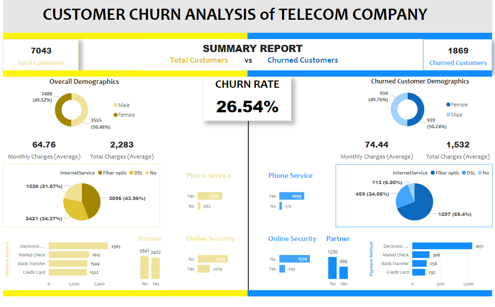

# Customer Churn Analysis & Dashboarding

## **Project Overview**

This project focuses on Exploratory Data Analysis (EDA) and dashboarding to understand customer churn patterns. Using Python (Matplotlib, Seaborn) for EDA and Power BI for visualization, we extract meaningful insights to help businesses reduce churn and improve customer retention.

## **Tools & Technologies**

Python: Pandas, Matplotlib, Seaborn (for EDA)

Power BI: Data visualization and dashboard creation

## **Power BI Dashboard Preview**

The objective was to compare the key metrics (payment method, demographics, monthly charges etc) between the total customers of the telecom company with that of the churned customers.

## **Exploratory Data Analysis (EDA)**

Feature Analysis: Visualized churn distribution by different attributes.

Correlation Study: Examined relationships between variables affecting churn.

## **How to Use**

Run EDA Notebook: Open and execute the Jupyter Notebook (Exploratory Data Analysis.ipynb).

Explore Dashboard: Open the Power BI file (customer churn analysis- telecom.pbix) to interact with the visualization.

## **Conclusion**

This project provides key insights into customer churn behavior through data analysis and visualization. The findings can help businesses take proactive measures to improve customer retention and reduce churn rates

Note:

    The dataset is from Kaggle.
